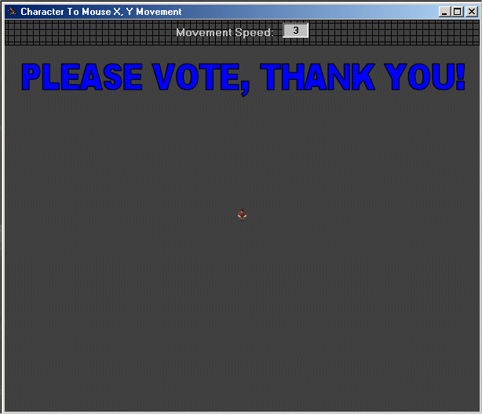



## Character To Mouse X, Y Movement

### Description

Shows you how to move any object to any position on the form, just by clicking there. This code could be useful for certain games like 'Command And Conquer'. This code also has comments, to help guide you through whats happening. If you like this code please vote for me. Also if you have any questions then you may email them to me at frillyozz@comcast.net. Thank you for looking.
 
### More Info
 
Text, Mouse X and Y

Timer Control

Moving Character

             |
---                |---
**Submitted On**   |2003-07-25 01:04:04
**By**             |[Derek](https://github.com/Planet-Source-Code/PSCIndex/blob/master/ByAuthor/derek.md)
**Level**          |Beginner
**User Rating**    |4.0 (8 globes from 2 users)
**Compatibility**  |VB 5\.0, VB 6\.0
**Category**       |[Miscellaneous](https://github.com/Planet-Source-Code/PSCIndex/blob/master/ByCategory/miscellaneous__1-1.md)
**World**          |[Visual Basic](https://github.com/Planet-Source-Code/PSCIndex/blob/master/ByWorld/visual-basic.md)
**Archive File**   |[Character\_1621757302003\.zip](https://github.com/Planet-Source-Code/derek-character-to-mouse-x-y-movement__1-47269/archive/master.zip)

